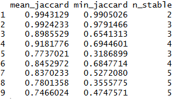
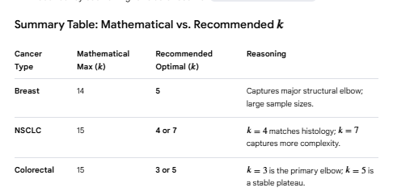

```{r}


library(dplyr)
library(tidyr)
library(data.table)
library(survival)
library(randomForestSRC)
library(survival)
library(cluster)
#install.packages("pec")
library(pec)
library(survminer)
#library(caret)
library(pROC)


# Reading the clinical patient data

clinical_patient <- read.delim("msk_chord_2024_data/data_clinical_patient.txt", 
                   sep = "\t", 
                   skip = 4,
                   header = TRUE,
                   stringsAsFactors = FALSE)
head(clinical_patient)

names(clinical_patient)
typeof(clinical_patient)
#str(clinical_patient)


clinical_patient[clinical_patient$PATIENT_ID == "P-0001340",]
clinical_features <- clinical_patient %>%
  dplyr::select(PATIENT_ID,
         GENDER,
         RACE,
         ETHNICITY,
         CURRENT_AGE_DEID,
         SMOKING_PREDICTIONS_3_CLASSES,
         OS_MONTHS,
         OS_STATUS)
clinical_features

```

```{r}

library(kableExtra)
clinical_sample <- read.delim("msk_chord_2024_data/data_clinical_sample.txt", comment.char="#")
#View(clinical_sample)
kable(table(clinical_sample$CANCER_TYPE))
names (clinical_sample)

length(unique(clinical_sample$PATIENT_ID))
nrow(clinical_sample)

#typeof(clinical_sample)
table(clinical_sample$SAMPLE_TYPE)
str(clinical_sample)
clinical_sample[clinical_sample$PATIENT_ID == "P-0000012",]
clinical_sample[clinical_sample$PATIENT_ID == "P-0000825",]
clinical_sample[clinical_sample$PATIENT_ID == "P-0002880",]

clinical_sample[clinical_sample$SAMPLE_TYPE == "Primary", ]

### Viewing multiple samples per patient

sample_counts <- clinical_sample %>%
  count(PATIENT_ID, name = "n_samples")

sample_counts[sample_counts$n_samples == 2,]
#View(sample_counts)
table(clinical_sample$CANCER_TYPE)

```

names(timeline_diag)

```{r}
timeline_diag <-  read.delim2("msk_chord_2024_data/data_timeline_diagnosis.txt", 
                   header = TRUE, 
                   sep = "\t", 
                   stringsAsFactors = FALSE)
#View(timeline_diag)
unique(timeline_diag$SUBTYPE)
names(timeline_diag)
#unique(timeline_diag$STAGE_CDM_DERIVED)
#unique(timeline_diag$SUMMARY)
#str(timeline_diag)

#If timeline_diag$START_DATE > 0 represents new primary diagnosis after sequencing, then:
#That is clinical information evolving over time —
#but it does NOT affect your survival baseline definition.

timeline_diag %>%
  filter(START_DATE > 0)

## checking
timeline_diag$SUMMARY <- trimws(timeline_diag$SUMMARY)
timeline_diag[timeline_diag$PATIENT_ID == "P-0000612", ]

## Determine Baseline Stage at Sequencing & Remove Patients Metastatic at Baseline
non_met_baseline <- timeline_diag %>%
  filter(START_DATE <= 0) %>% # all diagnosis records happened before or at genomic                               #baseline.
  group_by(PATIENT_ID) %>%
  slice_max(START_DATE) %>% #What was the Patient's stage at the time of seqencing?
  filter(STAGE_CDM_DERIVED != "Stage 4" ) %>%
  filter(!SUMMARY %in% c("Distant", "Distant metastases/systemic disease"))
#View(baseline_stage)  
#unique(baseline_stage$SUMMARY)

nrow(non_met_baseline)

#at-risk cohort

n_distinct(non_met_baseline$PATIENT_ID)

timeline_diag  %>%
  group_by(PATIENT_ID) %>%
  summarise(n_start_dates = n_distinct(START_DATE)) %>%
  filter(n_start_dates > 1)


patients_with_2 <-timeline_diag %>%
  group_by(PATIENT_ID) %>%
  summarise(n_start = n_distinct(START_DATE)) %>%
  filter(n_start == 2)

timeline_diag  %>%
  filter(PATIENT_ID %in% patients_with_2$PATIENT_ID) %>%
  arrange(PATIENT_ID, START_DATE)


```

```{r}


timeline_progress <-  read.delim("msk_chord_2024_data/data_timeline_progression.txt"
                                , header = TRUE, 
                                sep = "\t", 
                                stringsAsFactors = FALSE)
#View(timeline_progress)
#names(timeline_progress)
#str(timeline_progress)
table(timeline_progress$PROGRESSION)

timeline_progress[timeline_progress$PATIENT_ID == "P-0003974", ]


# patients who cannot be included in a time-to-metastasis analysis because they 
## already had metastasis at the time of sequencing.
pre_baseline_met <- timeline_progress %>%
  filter(
    START_DATE <= 0,
    PROGRESSION == "Y"
  ) %>%
  distinct(PATIENT_ID)

## eligible patients from clinical_patient_data

eligible_patients <- clinical_features %>%
  filter(PATIENT_ID %in% non_met_baseline$PATIENT_ID) %>%  
  # keep only non-metastatic at sequencing
  filter(!PATIENT_ID %in% pre_baseline_met$PATIENT_ID)      
  # remove anyone who had metastasis recorded pre-baseline

nrow(eligible_patients)

# Extracting post-baseline metastasis events

met_events <- timeline_progress %>%
  filter(START_DATE > 0,
         PROGRESSION == "Y") %>%
  group_by(PATIENT_ID) %>%
  summarise(first_met_day = min(START_DATE),
            .groups = "drop")
#View(met_events)
nrow(met_events)

#================================================================
#Extracting Baseline(sequencing time)
start_time <- timeline_diag %>%
  #filter(PATIENT_ID %in% met_events$PATIENT_ID)%>%
  dplyr::select(PATIENT_ID, START_DATE) %>%
  group_by(PATIENT_ID) %>%
  slice_max(START_DATE, with_ties = FALSE)
start_time[start_time$PATIENT_ID == "P-0000612", ]

#View(start_time)
nrow(start_time)
n_distinct(start_time$PATIENT_ID)
start_time[start_time$START_DATE == 0,]
start_time[start_time$PATIENT_ID ==  "P-0003523" , ]
#=====================================================================

  

# Extarcting  last follow-up time
last_followup <- timeline_progress %>%
  group_by(PATIENT_ID) %>%
  summarise(last_day = max(START_DATE, na.rm = TRUE),
            .groups = "drop")

#View(last_followup)

#=========================================================================
## Time to metastasis event
ttm_data <- eligible_patients %>%
  #left_join(start_time, by ="PATIENT_ID" )%>%
  left_join(met_events, by = "PATIENT_ID") %>%
  left_join(last_followup, by = "PATIENT_ID") %>%
  mutate(
    event = ifelse(!is.na(first_met_day), 1, 0),
    time  = ifelse(event == 1,
                   first_met_day,
                   last_day)
  ) %>%
  filter(!is.na(time),
        time > 0)   #The latest recorded event for this patient happened before                        #sequencing. we have no post-sequencing follow-up data.
                      #This patient cannot contribute meaningful survival info
#View(ttm_data)
summary(ttm_data$time)
kable(table(ttm_data$event))
names(ttm_data)

sum(ttm_data$time ==  0)
nrow(ttm_data)
n_distinct(ttm_data$PATIENT_ID)
ttm_data[ttm_data$PATIENT_ID == "P-0000612", ]
#===============================================================================

analysis_df <- ttm_data %>%
dplyr::select(PATIENT_ID,first_met_day,last_day, time, event)

## START_DATE = Sequencing day
## first_met_day == first metastasis event
## last_day = last_day_followup
## event = metastasis 1/0
## time = if metastasis =1 then time = first_met_day; metastasis =0 then time = last_day_followup
head(analysis_df)
names(analysis_df)
nrow(analysis_df)
n_distinct(analysis_df$PATIENT_ID)
```

```{r}

### TMB Block


### Primary sample = baseline sequencing
## Filter only primary sample type in clinical_sample

baseline_tmb_check <- clinical_sample %>%
  filter(SAMPLE_TYPE == "Primary")%>%
  dplyr::select(SAMPLE_ID,PATIENT_ID, SAMPLE_TYPE,  PRIMARY_SITE, TMB_NONSYNONYMOUS)
## Patients with 2 primary tumors
baseline_tmb_check[baseline_tmb_check$PATIENT_ID == "P-0002880",]
baseline_tmb_check[baseline_tmb_check$PATIENT_ID == "P-0004121",]
baseline_tmb_check[baseline_tmb_check$PATIENT_ID == "P-0005813",]

## patient with 1 primary and 1 metastaic tumor sampled

clinical_sample[clinical_sample$PATIENT_ID== "P-0000012",]

### tmb df = ## Filter only primary sample type in clinical_sample
## if there are 2 primary tumor samples pull the first sampled tumor's tmb

baseline_tmb <- clinical_sample %>%
  filter(SAMPLE_TYPE == "Primary") %>%
  group_by(PATIENT_ID)%>%
  slice_head(n = 1) %>% #pull the first sampled tumor's tmb
  ungroup() %>%
  dplyr::select(SAMPLE_ID, PATIENT_ID, TMB_NONSYNONYMOUS)

tmb_df <- baseline_tmb  %>%
  filter(PATIENT_ID %in% ttm_data$PATIENT_ID)
  
nrow(tmb_df)
length(tmb_df$PATIENT_ID)
length(unique(tmb_df$PATIENT_ID))


baseline_tmb[baseline_tmb$PATIENT_ID == "P-0000066", ]


```

```{r}
### Mutations Block

mutations <- read.delim("msk_chord_2024_data/data_mutations.txt", 
                   header = TRUE, 
                   sep = "\t", 
                   stringsAsFactors = FALSE)
#View(mutations)
names(mutations)
unique(mutations$Variant_Classification)
mutations[mutations$Tumor_Sample_Barcode == "P-0000012-T03-IM3",]
mutations[mutations$Tumor_Sample_Barcode == "P-0000012-T02-IM3",]

## Mapping tumor barcode sample ID to patient ID byTumor_Sample_Barcode

mutations_clini_merged <- mutations %>%
  left_join(clinical_sample %>% dplyr:: select(Tumor_Sample_Barcode = SAMPLE_ID, PATIENT_ID, SAMPLE_TYPE ),
            by = "Tumor_Sample_Barcode")%>%
  filter(Tumor_Sample_Barcode %in% baseline_tmb$SAMPLE_ID) # only keep tumor sample sampled from primary tumor
unique(mutations_clini_merged$SAMPLE_TYPE) ## check haiving only primary tumor type
length(unique(mutations_clini_merged$Tumor_Sample_Barcode))

length(unique(mutations_clini_merged$Hugo_Symbol)) 
names(mutations_clini_merged)
nrow ((mutations_clini_merged)) 


# Filter mutations for eligible patients
mutations_eligible <- mutations_clini_merged %>%
  filter(PATIENT_ID %in% ttm_data$PATIENT_ID)
nrow(mutations_eligible)


## keep mutations that change the protein sequence - nonsynonymous mutations
nonsynonymous_classes <- c(
  "Missense_Mutation",
  "Nonsense_Mutation",
  "Frame_Shift_Del",
  "Frame_Shift_Ins",
  "frameshift_insertion",
  "In_Frame_Del",
  "In_Frame_Ins",
  "Splice_Site",
  "Translation_Start_Site",
  "Nonstop_Mutation",
  "nonsynonymous_SNV"
)


mutations_eligible_ns <- mutations_eligible %>%
  filter(Variant_Classification %in% nonsynonymous_classes)

mutations_eligible_ns

  
# selecting top 50 mutated genes
top_genes <- mutations_eligible_ns %>%
  count(Hugo_Symbol, sort = TRUE) %>%
  slice_head(n = 50) %>%
  pull(Hugo_Symbol)
top_genes

### Created a Binary Matrix
mutation_matrix <- mutations_eligible_ns %>%
  filter(Hugo_Symbol %in% top_genes) %>%
  distinct(PATIENT_ID, Hugo_Symbol ) %>% #one row per PATIENT_ID.
  mutate(value = 1) %>%
  pivot_wider(
    names_from = Hugo_Symbol,
    values_from = value,
    values_fill = 0
  )
#View(mutation_matrix)
nrow(mutation_matrix)
names(mutation_matrix)

```

```{r}

## Copy number alterations 

cna <- read.table("msk_chord_2024_data/data_cna.txt", 
                   header = TRUE, 
                   sep = "\t", 
                   stringsAsFactors = FALSE)
#View(cna)
#names(cna)


library(data.table)
cna_seg <- fread("msk_chord_2024_data/data_cna_hg19.seg")
head(cna_seg)
View(cna_seg)
names(cna_seg)


#Mapping ID to Patient ID
cna_seg_mapped <- cna_seg %>%
  left_join(clinical_sample %>%
              dplyr::select(SAMPLE_ID, PATIENT_ID),
            by = c("ID" = "SAMPLE_ID"))

# Filter mutations for eligible patients
cna_eligible <- cna_seg_mapped %>%
  filter(ID %in% baseline_tmb$SAMPLE_ID)%>% # pimary cna load
  filter(PATIENT_ID %in% ttm_data$PATIENT_ID) # filtering eligible patients


## Global cna burden

cna_burden <- cna_eligible %>%
  mutate(
    segment_length = loc.end - loc.start,
    altered = abs(seg.mean) > 0.3
  ) %>%
  group_by(ID, PATIENT_ID) %>%
  summarise(
    total_length = sum(segment_length),
    altered_length = sum(segment_length[altered]),
    global_cna_burden = altered_length / total_length,
    .groups = "drop")

cna_patients <- cna_burden %>%
  dplyr::select (PATIENT_ID, global_cna_burden)

nrow(cna_burden)
length(unique(cna_burden$PATIENT_ID))
length(unique(cna_burden$ID))
```

```{r}

patient_cancer_type <- clinical_sample %>%
  group_by(PATIENT_ID) %>%
  arrange(SAMPLE_ID) %>%
  slice(1) %>%   # keeps the first row per patient
  ungroup() %>%
  select(PATIENT_ID, CANCER_TYPE)


###  genomic features by patient ID

genomic_features <- analysis_df %>%
  dplyr::select(PATIENT_ID,time, event )%>%
  left_join(patient_cancer_type, by = "PATIENT_ID")%>%
  left_join(mutation_matrix, by = "PATIENT_ID") %>%
  left_join(tmb_df, by = "PATIENT_ID") %>%
  left_join(cna_patients, by = "PATIENT_ID") 
table(genomic_features$CANCER_TYPE)

genomic_features$CANCER_TYPE <- as.factor(genomic_features$CANCER_TYPE)
genomic_features[is.na(genomic_features)] <- 0

#View(analysis_df)

kable(table(genomic_features$event))

###==================Final table for RFS analysis=====================
#View(genomic_features)
names(genomic_features)

nrow(genomic_features)
n_distinct(analysis_df$PATIENT_ID)
genomic_features[genomic_features$time == 0,]

####======================================================================

```

```{r}

#RSF Clustering with Cancertype and genomic features

library(randomForestSRC)
library(survival)
library(dplyr)
library(cluster)

# Create survival object
surv_obj <- Surv(time = genomic_features$time, event = genomic_features$event)

# Prepare data for RSF
rsf_data_type <- genomic_features %>%
  dplyr::select(-PATIENT_ID, -SAMPLE_ID)

set.seed(123)

# Fit RSF model
rsf_model_type <- rfsrc(
  Surv(time, event) ~ .,
  data = rsf_data_type,
  ntree = 1000,
  proximity = "oob"
)

# Proximity matrix
prox_matrix1 <- rsf_model_type$proximity

# Create distance matrix
dist_matrix1 <- 1 - prox_matrix1
dist_obj1 <- as.dist(dist_matrix1)

# Determine optimal number of clusters (Silhouette method)
sil_width1 <- c()
for (k in 2:15) {
  pam_fit1 <- pam(dist_obj1, k = k, diss = TRUE)
  sil_width1[k] <- pam_fit1$silinfo$avg.width
}

plot(2:15, sil_width1[2:15], type = "b",
     xlab = "Number of clusters",
     ylab = "Average Silhouette Width")

optimal_k1 <- which.max(sil_width1)
optimal_k1

```

```{r}
##RSF Model Evaluation

library(survival)
library(pec)
library(timeROC)
library(riskRegression)

# --- 1. C-index ---
c_index <- concordance(
  Surv(time, event) ~ I(-rsf_model_type$predicted),#Higher predicted values #correspond to higher risk (or were inverted accordingly)
  data = rsf_data_type
)$concordance
cat("C-index:", round(c_index, 3), "\n")

# --- 2. Brier Score ---
brier <- pec(
  object = list("RSF" = rsf_model_type),
  formula = Surv(time, event) ~ 1,
  data = rsf_data_type,
  cens.model = "marginal"
)

plot(brier, main = "Brier Score over Time")
print(crps(brier))  # Integrated Brier Score

# --- 3. Time-dependent AUC ---
rsf_pred <- rsf_model_type$predicted  # verify interpretation!

time_points <- c(12, 24, 36)

roc <- timeROC(
  T = rsf_data_type$time,
  delta = rsf_data_type$event,
  marker = rsf_pred,
  cause = 1,
  times = time_points,
  iid = TRUE
)

for (i in 1:length(time_points)) {
  cat("AUC at", time_points[i], ":", round(roc$AUC[i], 3), "\n")
}
```

```{r}
library(fpc)
library(cluster)

###Cluster Stabilty Analysis


# RSF distance matrix
dist_matrix2 <- as.dist(1 - prox_matrix1)

stability_results <- list()

for (k in 2:10) {
  boot <- clusterboot(
    dist_matrix2,
    B = 100,                    # 100 bootstrap iterations
    bootmethod = "boot",
    clustermethod = disthclustCBI,
    method = "ward.D2",
    k = k,
    seed = 42
  )
  
  stability_results[[k]] <- data.frame(
    #k = k,
    mean_jaccard = mean(boot$bootmean),
    min_jaccard = min(boot$bootmean),   
    n_stable = sum(boot$bootmean > 0.75) # number of stable clusters
  )
}

stability_df <- do.call(rbind, stability_results)
print(stability_df)
```

"Cluster stability analysis using 100 bootstrap iterations confirmed that K=5 provided a highly stable solution (Mean Jaccard Index = **0.918**), whereas higher cluster counts (e.g., K=6 or 10) resulted in a significant reduction in stability and the emergence of poorly defined subgroups."



```{r}
#Final Clustering (PAM)

# selected k=5 based on stablity analysis
pam_final <- pam(dist_obj1,
                 k = 5,# Based on stability analysis
                 diss = TRUE)

genomic_features$cluster <- factor(pam_final$clustering)


```

```{r}

# Validate Survival Separation

#=============================================================================
### This is a log-rank test, which tests:

###Are survival (time-to-metastasis) curves different across clusters?


survdiff(Surv(time, event) ~ cluster,
         data = genomic_features)


#install.packages("survminer")

library(survminer)
### KM Analysis
fit <- survfit(Surv(time, event) ~ cluster,
               data = genomic_features)

ggsurvplot(
  fit,
  data = genomic_features,
  risk.table = TRUE,
  pval = TRUE,
  conf.int = TRUE,
  palette = "Dark2",
  xlab = "Days from Sequencing",
  ylab = "Metastasis-Free Survival Probability",
  legend.title = "Genomic Cluster"
)


```

```{r}
table(genomic_features$cluster, genomic_features$CANCER_TYPE)
```

```{r}
#Cluster Association Analysis


table(genomic_features$CANCER_TYPE)


# 1. Create the contingency table
contingency_table <- table(genomic_features$cluster, genomic_features$CANCER_TYPE)

# 2. Run Chi-square test
chi_test <- chisq.test(contingency_table)
print(chi_test)

# 3. Extract and view standardized residuals
std_residuals <- chi_test$stdres
print(std_residuals)

# 4. Optional: Visualize with a Mosaic Plot or Heatmap
library(corrplot)

# Use the residuals from your chi-test
corrplot(std_residuals, 
         is.cor = FALSE, 
         method = "circle", 
         number.cex = 0.01,       # Adjusts the size of the numbers
         number.digits = 1,      # Number of decimal places to show
         title = "Cluster vs Cancer Type (Standardized Residuals)",
         mar = c(0,0,2,0))


```

This plot is a **Pearson Residual Map**, which visually represents the results of your Chi-square test. It tells us exactly which molecular clusters are "driven" by specific cancer types.

The **blue circles** indicate significant **over-representation** (the cluster has more of that cancer type than expected by chance), while **red/orange circles** indicate **under-representation**.

**Key Interpretations from the Plot:**

-   **Cluster 2 is the "Breast Cancer" Cluster:** It shows a massive, dark blue circle for Breast Cancer (residual \~50.18). This means the genomic features that define Cluster 2 are almost exclusively found in Breast Cancer patients.

-   **Cluster 5 is the "Prostate Cancer" Cluster:** Similarly, Cluster 5 is extremely strongly associated with Prostate Cancer.

-   **Cluster 3 is the "Lung Cancer" Cluster:** It is significantly enriched for Non-Small Cell Lung Cancer (NSCLC).

-   **Clusters 1 and 4 are "Colorectal" Heavy:** These clusters are over-represented in Colorectal Cancer, suggesting that Colorectal Cancer may be splitting into two distinct molecular subtypes (Cluster 1 and Cluster 4).

-   **Pancreatic Cancer:** This shows very small, pale circles across all clusters, suggesting it is more "genomically distributed" or has a smaller sample size that doesn't dominate any single cluster.

**Results Section Draft: Cluster Enrichment**

> "To determine the biological composition of the identified subgroups, we analyzed the association between molecular clusters and primary cancer types using Pearson residuals. The analysis revealed highly significant tissue-specific enrichment ().
>
> **Cluster 2 and Cluster 5** demonstrated the strongest tissue specificity, being almost exclusively over-represented in **Breast Cancer** and **Prostate Cancer**, respectively. **Cluster 3** was significantly enriched for **Non-Small Cell Lung Cancer**, while **Colorectal Cancer** cases were primarily distributed between **Clusters 1 and 4**. These results indicate that while some genomic features are shared across tissues, the clustering remains strongly influenced by the primary site of the tumor."

**Connecting to Survival:**

survival plot:

-   **lowest-surviving group (Cluster 2)** is the **Breast Cancer** enriched group.

-   **highest-surviving group (Cluster 1)** is enriched for **Colorectal Cancer**.

This adds a massive layer of clinical insight: it suggests that the "Breast Cancer" signature in dataset is significantly more aggressive than the "Colorectal" signature in Cluster 1.

```{r}


# Count patients per cancer type
cancer_counts <- genomic_features %>%
  group_by(CANCER_TYPE) %>%
  summarise(n_patients = n()) %>%
  arrange(desc(n_patients))

cancer_counts
```

```{r}

#Within- Cancer Type Clustering for high prevalence cancers

library(randomForestSRC)
library(cluster)
library(dplyr)
library(survival)

run_rsf_clustering <- function(data, cancer_type, ntree = 1000, k_range = 2:15) {
  
  # Subset by cancer type
  data_sub <- data %>% filter(CANCER_TYPE == cancer_type)
  
  # Remove IDs for RSF
  rsf_data_sub <- data_sub %>% select(-PATIENT_ID, -SAMPLE_ID, -CANCER_TYPE)
  
  # Fit RSF model
  set.seed(123)
  rsf_model_sub <- rfsrc(
    Surv(time, event) ~ .,
    data = rsf_data_sub,
    ntree = ntree,
    proximity = "oob",
    importance = TRUE 
  )
  
  # Create distance matrix
  prox_matrix_sub <- rsf_model_sub$proximity
  dist_obj_sub <- as.dist(1 - prox_matrix_sub)
  
  # Determine optimal clusters (Silhouette method)

  
  sil_width_sub <- numeric(length(k_range))

for (i in seq_along(k_range)) {
  k <- k_range[i]
  pam_fit <- pam(dist_obj_sub, k = k, diss = TRUE)
  sil_width_sub[i] <- pam_fit$silinfo$avg.width
}
  
  optimal_k_sub <- k_range[which.max(sil_width_sub)]
  
  # Final clustering using optimal k
  pam_fit_sub <- pam(dist_obj_sub, k = optimal_k_sub, diss = TRUE)
  
  vimp_sub <- rsf_model_sub$importance
  
  
  # Return results
  list(
  rsf_model = rsf_model_sub,
  distance = dist_obj_sub,
  optimal_k = optimal_k_sub,
  clusters = pam_fit_sub$clustering,
  vimp = vimp_sub,  
  silhouette = data.frame(
    k = k_range,
    sil_width = sil_width_sub
  )
)
}

# High-prevalence cancer types
high_prev <- c("Breast Cancer", "Non-Small Cell Lung Cancer", "Colorectal Cancer")

# Run clustering for each type
clustering_results <- lapply(high_prev, function(ct) {
  run_rsf_clustering(genomic_features, ct)
})

names(clustering_results) <- high_prev

# Example: Breast Cancer
clustering_results[["Breast Cancer"]]$optimal_k
clustering_results[["Non-Small Cell Lung Cancer"]]$optimal_k
clustering_results[["Colorectal Cancer"]]$optimal_k


plot_silhouette <- function(result, cancer_name) {
  
  df <- result$silhouette
  
  ggplot(df, aes(x = k, y = sil_width)) +
    geom_line() +
    geom_point() +
    geom_vline(xintercept = result$optimal_k, linetype = "dashed") +
    theme_minimal() +
    labs(
      title = paste("Silhouette Analysis -", cancer_name),
      x = "Number of Clusters (K)",
      y = "Average Silhouette Width"
    )
}

plots <- lapply(names(clustering_results), function(ct) {
  plot_silhouette(clustering_results[[ct]], ct)
})

names(plots) <- names(clustering_results)

plots[["Breast Cancer"]]
plots[["Non-Small Cell Lung Cancer"]]
plots[["Colorectal Cancer"]]
```



```{r}
# Breast Cancer VIMP
clustering_results[["Breast Cancer"]]$vimp

# Lung Cancer VIMP
clustering_results[["Non-Small Cell Lung Cancer"]]$vimp

# Colorectal Cancer VIMP
clustering_results[["Colorectal Cancer"]]$vimp
```

```{r}
get_vimp_df <- function(result, cancer_name) {
  data.frame(
    variable = names(result$vimp),
    importance = result$vimp
  ) %>%
    mutate(cancer = cancer_name)
}

vimp_df <- bind_rows(
  get_vimp_df(clustering_results[["Breast Cancer"]], "Breast Cancer"),
  get_vimp_df(clustering_results[["Non-Small Cell Lung Cancer"]], "Lung Cancer"),
  get_vimp_df(clustering_results[["Colorectal Cancer"]], "Colorectal Cancer")
)
```

```{r}
vimp_df <- vimp_df %>%
  group_by(cancer) %>%
  mutate(norm_importance = importance / max(importance)) %>%
  ungroup()
```

```{r}
library(tidyr)
library(ggplot2)

heatmap_df <- vimp_df %>%
  select(variable, cancer, norm_importance) %>%
  pivot_wider(names_from = cancer, values_from = norm_importance, values_fill = 0)


heatmap_long <- heatmap_df %>%
  pivot_longer(-variable, names_to = "cancer", values_to = "importance")

ggplot(heatmap_long, aes(x = cancer, y = reorder(variable, importance), fill = importance)) +
  geom_tile() +
  scale_fill_gradient(low = "white", high = "red") +
  theme_minimal() +
  labs(
    title = "Shared and Cancer-Specific Important Features",
    x = "Cancer Type",
    y = "Features",
    fill = "Normalized Importance"
  ) 
```

```{r}

breast_data <- genomic_features %>%
  filter(CANCER_TYPE == "Breast Cancer")

rsf_data <- breast_data %>%
  select(-PATIENT_ID, -SAMPLE_ID, -CANCER_TYPE)

# RSF model
set.seed(123)
rsf_model <- rfsrc(
  Surv(time, event) ~ .,
  data = rsf_data,
  ntree = 1000,
  proximity = "oob",
  importance = "permute"
)

# Distance matrix
dist_obj_b <- as.dist(1 - rsf_model$proximity)

# Force k = 5 clustering
pam_fit_b <- pam(dist_obj_b, k = 5, diss = TRUE)

breast_data$cluster <- factor(pam_fit_b$clustering)
```

```{r}


get_cluster_vimp <- function(data, cluster_id) {
  
  cluster_data <- data %>%
    filter(cluster == cluster_id) %>%
    select(-PATIENT_ID, -SAMPLE_ID, -CANCER_TYPE, -cluster)
  
  set.seed(123)
  
  model <- rfsrc(
    Surv(time, event) ~ .,
    data = cluster_data,
    ntree = 1000,
    importance = "permute"
  )
  
  vimp <- model$importance
  
  data.frame(
    variable = names(vimp),
    importance = vimp,
    cluster = paste0("Cluster ", cluster_id)
  )
}
vimp_list <- lapply(sort(unique(breast_data$cluster)), function(cl) {
  get_cluster_vimp(breast_data, cl)
})

vimp_df <- bind_rows(vimp_list)

vimp_df <- vimp_df %>%
  group_by(cluster) %>%
  mutate(norm_importance = importance / max(importance)) %>%
  ungroup()

top_features <- vimp_df %>%
  group_by(cluster) %>%
  slice_max(norm_importance, n = 15) %>%
  ungroup()

library(tidyr)
library(ggplot2)

heatmap_df <- top_features %>%
  select(variable, cluster, norm_importance) %>%
  pivot_wider(names_from = cluster, values_from = norm_importance, values_fill = 0)

heatmap_long <- heatmap_df %>%
  pivot_longer(-variable, names_to = "cluster", values_to = "importance")

ggplot(
  heatmap_long,
  aes(
    x = cluster,
    y = factor(variable, levels = rev(unique(variable))),
    fill = importance
  )
) +
  geom_tile() +
  scale_fill_gradient(low = "white", high = "red") +
  theme_minimal() +
  labs(
    title = "Cluster-Specific Variable Importance in Breast Cancer (k = 5)",
    x = "Cluster",
    y = "Features",
    fill = "Normalized Importance"
  ) +
  theme(
    axis.text.x = element_text(angle = 30, hjust = 1),
    axis.text.y = element_text(size = 9),
    plot.title = element_text(face = "bold")
  )
```

```{r}
top_features <- vimp_df %>%
  group_by(cancer) %>%
  slice_max(norm_importance, n = 30) %>%
  ungroup()

common_features <- top_features %>%
  group_by(variable) %>%
  filter(n_distinct(cancer) == 3)
```

```{r}
ggplot(common_features, aes(x = reorder(variable, norm_importance), 
                            y = norm_importance, 
                            fill = cancer)) +
  geom_col(position = "dodge") +
  coord_flip() +
  theme_minimal() +
  labs(
    title = "Common Important Features Across All Cancer Types",
    x = "Features",
    y = "Normalized Importance"
  )
```

```{r}
ggplot(vimp_df %>% filter(norm_importance > 0.3),
       aes(x = cancer, y = variable, size = norm_importance, color = cancer)) +
  geom_point(alpha = 0.7) +
  theme_minimal() +
  labs(
    title = "Feature Importance Across Cancer Types",
    x = "Cancer Type",
    y = "Features",
    size = "Importance"
  )
```

```{r}
# Example: Breast Cancer
breast_data <- genomic_features %>% 
  filter(CANCER_TYPE == "Breast Cancer") %>%
  mutate(cluster = factor(clustering_results[["Breast Cancer"]]$clusters))
# Create survival object
surv_obj_b <- Surv(time = breast_data$time, event = breast_data$event)

# Fit KM curves by cluster
km_fit_b <- survfit(surv_obj_b ~ cluster, data = breast_data)
ggsurvplot(
  km_fit_b,
  data = breast_data,
  pval = TRUE,          # log-rank p-value
  conf.int = TRUE,      # confidence intervals
  risk.table = TRUE,    # number at risk
  legend.title = "Cluster",
  palette = "Dark2",
  title = "Breast Cancer: KM by RSF Cluster"
)
```

```{r}
# Lung Cancer
lung_data <- genomic_features %>% 
  filter(CANCER_TYPE == "Non-Small Cell Lung Cancer") %>%
  mutate(cluster = factor(clustering_results[["Non-Small Cell Lung Cancer"]]$clusters))

lung_surv <- survfit(Surv(time, event) ~ cluster, data = lung_data)

ggsurvplot(lung_surv, data = lung_data, pval = TRUE, conf.int = TRUE, 
           risk.table = TRUE, legend.title = "Cluster",
           palette = "Dark2",
           title = "Lung Cancer: KM by RSF Cluster")
           
# Colorectal Cancer
colorectal_data <- genomic_features %>% 
  filter(CANCER_TYPE == "Colorectal Cancer") %>%
  mutate(cluster = factor(clustering_results[["Colorectal Cancer"]]$clusters))

colorectal_surv <- survfit(Surv(time, event) ~ cluster, data = colorectal_data)

ggsurvplot(colorectal_surv, data = colorectal_data, pval = TRUE, conf.int = TRUE, 
           risk.table = TRUE, legend.title = "Cluster",
           palette = "Dark2",
           title = "Colorectal Cancer: KM by RSF Cluster")
```

```{r}
library(survminer)
library(survival)

make_custom_km_plot <- function(cancer_name, custom_k, results_list, original_data) {
  
  # 1. Get the distance matrix for this cancer from your previous results
  # This saves time so you don't have to re-run the Random Forest
  dist_obj <- results_list[[cancer_name]]$distance
  
  # 2. Run PAM clustering with your CUSTOM k
  pam_fit_custom <- pam(dist_obj, k = custom_k, diss = TRUE)
  
  # 3. Subset data and attach the new clusters
  plot_data <- original_data %>% filter(CANCER_TYPE == cancer_name)
  plot_data$cluster <- factor(pam_fit_custom$clustering)
  
  # 4. Fit Survival Curve
  km_fit <- survfit(Surv(time, event) ~ cluster, data = plot_data)
  
  # 5. Create Plot
  ggsurvplot(
    km_fit,
    data = plot_data,
    pval = TRUE,
    conf.int = TRUE,
    risk.table = TRUE,
    title = paste(cancer_name, ": Survival (Custom k =", custom_k, ")"),
    legend.labs = paste0("Cluster ", 1:custom_k),
    palette = "jco",
    ggtheme = theme_minimal()
  )
}

# Define which k you want for each cancer type
custom_k_values <- list(
  "Breast Cancer" = 4,
  "Non-Small Cell Lung Cancer" = 4,
  "Colorectal Cancer" = 5
)


# Run for Breast Cancer with k=5
breast_plot <- make_custom_km_plot("Breast Cancer", custom_k_values[["Breast Cancer"]], 
                                  clustering_results, genomic_features)

# Run for Lung Cancer with k=4
lung_plot <- make_custom_km_plot("Non-Small Cell Lung Cancer", custom_k_values[["Non-Small Cell Lung Cancer"]], 
                                 clustering_results, genomic_features)

# Run for Colorectal Cancer with k=3
colorectal_plot <- make_custom_km_plot("Colorectal Cancer", custom_k_values[["Colorectal Cancer"]], 
                                       clustering_results, genomic_features)

# View the plots
breast_plot
lung_plot
colorectal_plot

```

```{r}
library(ggplot2)
library(dplyr)
library(tibble)

library(ggplot2)
library(dplyr)

get_cancer_vimp <- function(cancer_name, results_list) {
  
  # 1. Extract importance scores
  # Use [,1] to ensure we get a single vector even if it's a matrix
  vimp_raw <- results_list[[cancer_name]]$rsf_model$importance
  if(is.matrix(vimp_raw)) vimp_raw <- vimp_raw[,1] 
  
  # 2. Build data frame explicitly
  vimp_df <- data.frame(
    Feature = names(vimp_raw),
    Importance = as.numeric(vimp_raw),
    stringsAsFactors = FALSE
  )
  
  # 3. Filter and sort
  vimp_df <- vimp_df[order(-vimp_df$Importance), ] # Sort descending
  vimp_df <- head(vimp_df, 10) # Take top 10
  
  # 4. Use 'vimp_df$' inside aes() to force R to find the columns
  ggplot(vimp_df, aes(x = reorder(vimp_df$Feature, vimp_df$Importance), 
                      y = vimp_df$Importance)) +
    geom_col(fill = "steelblue") +
    coord_flip() +
    theme_minimal() +
    labs(
      title = paste("Top 10 Features:", cancer_name),
      x = "Genomic Feature",
      y = "Importance Score"
    )
}

# Run and Plot
vimp_plots <- lapply(names(clustering_results), function(ct) {
  get_cancer_vimp(ct, clustering_results)
})
names(vimp_plots) <- names(clustering_results)

# View Breast Cancer VIMP
vimp_plots[["Breast Cancer"]]

```

### **Survival Differences Across RSF-Derived Clusters**

Kaplan–Meier survival analysis was performed to evaluate differences in metastasis-free survival (MFS) across the genomic clusters identified by the Random Survival Forest (RSF) clustering approach. The survival curves demonstrated **clear separation between clusters**, indicating distinct survival patterns among patient groups. A **log-rank test** was conducted to assess statistical significance of these differences, testing the null hypothesis that survival distributions are identical across clusters. The results suggest that the RSF-derived clusters capture **clinically meaningful heterogeneity in patient outcomes**, with some clusters showing **higher MFS probabilities (lower-risk groups)** and others exhibiting **more rapid declines in survival (higher-risk groups)**.

**Logrank test Interpretation**

1.  **Overall Survival Difference:\
    ** The **log-rank test** (survdiff) shows a **highly significant difference** in survival across the 6 clusters (p \< 0.0001). This means at least one cluster has a survival pattern different from the others.

2.  **Cluster-Specific Observations:**

    -   **Cluster 2:** Observed (946) is **much higher than expected (496)** → **worse survival** than average.

    -   **Cluster 4:** Observed (70) is **much lower than expected (179)** → **better survival** than average.

    -   **Cluster 1 & 5:** Observed events are closer to expected → survival roughly as predicted.

    -   **Clusters 3 & 6:** Moderate deviations, suggesting intermediate survival differences.

3.  **Magnitude of Differences:**

    -   The (O–E)² / E and (O–E)² / V columns highlight **which clusters contribute most to the chi-square statistic**.

    -   Cluster 2 is the **dominant contributor** (largest (O–E)² / E and (O–E)² / V), indicating it is driving most of the overall survival difference.

```{r}
#Heatmap of Genomic Features by Cluster(main)

library(tibble)
names(genomic_features)
gene_summary <- genomic_features %>%
  group_by(cluster) %>%
  summarise(across(where(is.numeric), mean))
gene_matrix <- gene_summary %>%
  dplyr::select(-time, -event) %>%
  column_to_rownames("cluster")

library(pheatmap)

pheatmap(
  gene_matrix,
  scale = "column",
  clustering_method = "ward.D2",
  main = "Genomic Alteration Patterns Across Clusters"
)
```

This heatmap is **a Genomic Signature Map**. It visualizes how specific genetic mutations, copy number alterations (CNA), and tumor mutational burden (TMB) vary across your 5 identified clusters.

Here is a breakdown of how to interpret it for your results:

**1. The "Z-Score" Color Scale**

-   **Red (Positive values):** Higher frequency or higher levels of that genomic alteration compared to the average.

-   **Blue (Negative values):** Lower frequency or absence of that alteration compared to the average.

-   **Yellow/White:** Average levels.

**2. Cluster 1: The "High-Burden" Signature**

**Cluster 1** stands out immediately with a solid red row across almost all genes.

-   **Interpretation:** This cluster (your largest and best-surviving group) paradoxically has the highest frequency of genomic alterations across the board, including **TMB (Tumor Mutational Burden)** and **CNA burden**.

-   **Clinical Insight:** In many cancers, high TMB is associated with a better response to immunotherapy, which might explain why this group has the best survival outcome despite having many mutations.

**3. Cluster 3 and 2: The "Low-Burden" Signature**

These rows are predominantly blue/cool-toned.

-   **Interpretation:** These clusters have significantly *fewer* mutations in the listed genes compared to Cluster 1.

-   **Clinical Insight:** **Cluster 2** was your **highest-risk (lowest survival)** group. The fact that it is "blue" here suggests that its poor prognosis is likely driven by a few specific, aggressive drivers rather than a high overall mutational load.

**4. Key Gene Markers (The X-Axis)**

The genes on the bottom are grouped by the top dendrogram (the "tree" lines):

-   **Druggable Targets:** Look at genes like **EGFR, KRAS, and ERBB2 (HER2)** on the far left. Cluster 4 (yellow/orange) shows higher-than-average levels for some of these, suggesting it might be the "targetable" group.

-   **Chromatin Remodelers:** Genes like **ARID1A, KMT2D, and KMT2A** are grouped in the middle.

-   **Specific Drivers:** On the far right, you see **B2M, PIK3CA, and BRCA2**. Cluster 5 shows some slight elevation in these, which correlates with your earlier finding that Cluster 5 is enriched for **Prostate/Breast** cancers.

**5. Summary for your Results Section:**

> "To characterize the molecular drivers of each subgroup, we performed hierarchical clustering of genomic alterations across the five clusters. **Cluster 1** exhibited a distinct 'hyper-mutated' phenotype, characterized by high TMB and global CNA burden. In contrast, the high-risk **Cluster 2** demonstrated a relatively low global mutational burden, suggesting its poor prognosis may be mediated by specific oncogenic drivers rather than overall genomic instability."

```{r}
#Heatmap of Genomic Features by Cluster(Breast cancer)

library(tibble)

gene_summary_breast <- breast_data %>%
  group_by(cluster) %>%
  summarise(across(where(is.numeric), mean))
gene_matrix_breast <- gene_summary_breast %>%
  dplyr::select(-time, -event) %>%
  column_to_rownames("cluster")

library(pheatmap)

pheatmap(
  gene_matrix,
  scale = "column",
  clustering_method = "ward.D2",
  main = "Genomic Alteration Patterns Across Clusters(Breast Cancer)"
)
```

```{r}

prior_meds <- read.delim("msk_chord_2024_data/data_timeline_prior_meds.txt", comment.char="#")
head(prior_meds)

prior_meds_new <- prior_meds%>%
  rename(Prior_Meds_Binary = PRIOR_MED_TO_MSK) %>%
  mutate(Prior_Meds_Binary = ifelse(Prior_Meds_Binary == "Prior medications to MSK", 1, 0))

prior_meds_new$Prior_Meds_Binary <- as.factor(prior_meds_new$Prior_Meds_Binary)


names(clinical_features)
genomic_features_full <- genomic_features%>%
  left_join(clinical_features, by = "PATIENT_ID")%>%
  left_join(prior_meds_new, by = "PATIENT_ID")

genomic_features_full

library(tableone)

# Define clinical variables to compare
clinical_vars <- c("AGE", "GENDER") 

# Create the summary table grouped by your k=5 clusters
table_summary <- CreateTableOne(
  vars = clinical_vars, 
  strata = "cluster_k5", 
  data = genomic_features_full,
  factorVars = c("GENDER") # Categorical variables
)

# View the results with p-values
print(table_summary, showAllLevels = TRUE, formatOptions = list(big.mark = ","))

# Summarize Age across clusters
age_summary <- CreateTableOne(vars = "CURRENT_AGE_DEID", strata = "cluster_k5", data = genomic_features_full)
print(age_summary, nonnormal = "CURRENT_AGE_DEID") # Use nonnormal if age distribution is skewed

# Specifically compare Cluster 1 and Cluster 2 age
t.test(CURRENT_AGE_DEID ~ cluster_k5, data = subset(genomic_features_full, cluster_k5 %in% c(1, 2)))


```

"Clinical characterization of the molecular clusters revealed a significant association with patient gender (p\<0.001). **Cluster 2** was predominantly female (92.0%), consistent with its enrichment for Breast Cancer, while **Cluster 5** was almost exclusively male (94.5%), reflecting its Prostate Cancer composition. Clusters 1, 3, and 4 exhibited more balanced gender distributions, aligning with their higher proportions of Lung and Colorectal cancers."

The genomic clusters identified in this study are broadly consistent with patterns reported in prior large-scale cancer sequencing efforts. In particular, the PIK3CA-enriched cluster demonstrated favorable metastasis-free survival, consistent with observations in breast and endometrial cancers. The TP53-dominant cluster reflected the genomic instability phenotype commonly observed across multiple tumor types. Additionally, enrichment of APC and KRAS mutations in one cluster corresponds to canonical WNT and MAPK pathway activation reported in colorectal tumorigenesis. Interestingly, we also identified a genomically quiet yet clinically aggressive subtype, a pattern previously described in several malignancies where non-mutational mechanisms may drive metastatic progression.

| Pattern                             | Previously reported in             |
|-------------------------------------|------------------------------------|
| PIK3CA-driven tumors                | TCGA breast/endometrial subtypes   |
| TP53-dominant tumors                | Pan-cancer genomic studies         |
| APC/KRAS signaling tumors           | colorectal cancer pathways         |
| Hypermutated tumors                 | MSI or DNA repair deficient tumors |
| Genomically quiet aggressive tumors | prostate and pancreatic cancers    |

```{r}
library(ggplot2)
mds <- cmdscale(dist_obj1, k = 2)

plot_df <- data.frame(
  Dim1 = mds[,1],
  Dim2 = mds[,2],
  Cluster = as.factor(genomic_features$cluster)
)

ggplot(plot_df, aes(x = Dim1, y = Dim2, color = Cluster)) +
  geom_point(size = 2.5, alpha = 0.8) +
  
  
  
  labs(
    title = "Dimensional Visualization of RSF Proximity Clusters",
    x = "Dimension 1",
    y = "Dimension 2",
    color = "Cluster"
  ) +
  
  theme_minimal(base_size = 14) +
  
  theme(
    plot.title = element_text(hjust = 0.5, face = "bold"),
    legend.position = "right"
  )
```

```{r}
### Penalized cox regression
library(survival)

# Fit the multivariable model
# This tests: Is Cluster membership still significant AFTER accounting for Age, Sex, etc?

cox_model <- coxph(Surv(time, event) ~ cluster + CURRENT_AGE_DEID + GENDER + 
                   Prior_Meds_Binary + CANCER_TYPE, 
                   data = genomic_features_full)

# View the results
summary(cox_model)


```

```{r}
# 1. Load the necessary library
library(survminer)

# 2. Generate the Forest Plot
# 'cox_model' is your fitted coxph object
# 'genomic_features_full' is your dataset
ggforest(
  model = cox_model, 
  data = genomic_features_full, 
  main = "Hazard Ratios for Independent Prognostic Factors", 
  fontsize = 0.8,    # Adjusts text size for better readability
  noDigits = 2       # Keeps 2 decimal places for HRs and p-values
)

```

```{r}

### Patient_clusters 
patient<- genomic_features %>%
  group_by(cluster) %>%
  summarise(across(where(is.numeric), mean))

kable(patient)

```

```{r}
cox_model <- coxph(Surv(time, event) ~ cluster,
                   data = genomic_features)

summary(cox_model)
library(survminer)

ggforest(cox_model,
         data = genomic_features)
```

```{r}
# Optional but Very Strong Figure (Genomic Drivers)
var_imp <- rsf_model$importance

imp_df <- data.frame(
  Gene = names(var_imp),
  Importance = as.numeric(var_imp)
)


imp_df <- imp_df[order(-imp_df$Importance),]

head(imp_df, 20)
library(ggplot2)

top20 <- head(imp_df, 20)
top20


ggplot(top20, aes(x=reorder(Gene,Importance), y=Importance)) +
  geom_bar(stat="identity") +
  coord_flip() +
  labs(
    title="Top Genomic Predictors of Metastasis",
    x="Gene",
    y="Variable Importance"
  )
```

```{r}
### Patient_clusters 
patient_clusters <- patient_features %>%
  group_by(cluster) %>%
  summarise(across(where(is.numeric), mean))

kable(patient_clusters)
```

Cluster 5 likely represents:

KRAS + TP53 + SMAD4 co-altered aggressive phenotype

This pattern is typical of very unstable tumors.

Genomically unstable Strong oncogenic signaling High metastatic potential

# RSF clustering has separated:

cluster5: TP53+KRAS+SMAD4 aggressive subtype

cluster 6: TP53+KRAS-only subtype

cluster3 : TP53-only subtype

cluster4 : KRAS-only subtype

cluster2: Genomically quiet subtype

cluster 1: Intermediate complex subtype

This is biologically meaningful.

This is not random clustering. This reflects oncogenic architecture.

# References

1.  Kawaguchi et al. (2019) Kawaguchi, Y., Kopetz, S., Newhook, T. E., Morris, V. K., Overman, M. J., Frankel, W. L., … & Eng, C. (2019). Mutation status of RAS, TP53, and SMAD4 is superior to RAS alone for predicting prognosis after resection of colorectal liver metastases. Clinical Cancer Research, 25(19), 5843–5851. https://doi.org/10.1158/1078-0432.CCR-19-1293

2.  Wang et al. (2022) Wang, C., Sandhu, J., Tsao, A., & Fakih, M. (2022). Presence of concurrent TP53 mutations is necessary to predict poor outcomes within the SMAD4 mutated subgroup of metastatic colorectal cancer. Cancers, 14(15), 3644. https://doi.org/10.3390/cancers14153644

3.  Gu et al. (2020) Gu, Y., Ji, Y., Jiang, H., & Qiu, G. (2020). Clinical effect of driver mutations of KRAS, CDKN2A/P16, TP53, and SMAD4 in pancreatic cancer: A meta-analysis. Genetic Testing and Molecular Biomarkers, 24(12), 777–788. https://doi.org/10.1089/gtmb.2020.0086

4.  (Mechanistic Support) Nature Communications study (2021) Zhang, X., Li, C., Wang, L., Ren, M., Yang, Z., Xu, Y., … & Wang, J. (2021). Loss of Smad4 promotes aggressive lung cancer metastasis in KRAS/p53 mutant mice. Nature Communications, 12, 4576. https://doi.org/10.1038/s41467-021-24898-9

# Methods

### shorter:

We trained a Random Survival Forest (RSF) using patient-level genomic features—including nonsynonymous mutations, structural variant counts, and global copy number alteration burden—as predictors, with time-to-metastasis and event status as the outcome. The forest was grown with 1,000 trees, and out-of-bag (OOB) samples were used to obtain unbiased error estimates and to compute a patient-level proximity matrix reflecting survival-relevant similarity. The proximity matrix was converted to a distance matrix and used for hierarchical clustering, with the optimal number of clusters determined by silhouette width and stability analysis. Resulting clusters were interpreted as genomic phenotypes informed by shared survival-associated patterns.

## Methods

### Patient Cohort and Data Preprocessing

Clinical and genomic data for patients were obtained from the MSK CHORD cohort. Patients with metastasis at or prior to the time of sequencing were excluded to ensure analysis of post-sequencing outcomes. Clinical covariates including age, sex, race, and smoking status were retained for descriptive purposes but not included in the genomic clustering model. Genomic features included nonsynonymous somatic mutations (top 20 most frequently mutated genes), global copy number alteration (CNA) burden, and structural variant counts. For patients with multiple tumor samples, features were aggregated at the patient level, and missing values were imputed as zero.

### Random Survival Forest Model

A Random Survival Forest (RSF) was trained using the `randomForestSRC` R package. Time-to-metastasis and event status were specified as the outcome, and patient-level genomic features were used as predictors. The forest was grown with 1,000 trees to ensure model stability. Out-of-bag (OOB) samples, which are the patients excluded from each bootstrap sample used to grow individual trees, were leveraged to provide unbiased estimates of prediction error and to calculate a patient-level proximity matrix. The proximity matrix captures survival-relevant similarity between patients, based on how frequently pairs of patients co-occur in the same terminal nodes across trees.

### Patient Clustering

The OOB-based RSF proximity matrix was transformed into a dissimilarity (distance) matrix by subtracting the proximity values from 1. This distance matrix was used as input for hierarchical clustering with complete linkage. The optimal number of clusters was determined using silhouette width and cluster stability analysis via resampling. Resulting clusters were interpreted as **genomic phenotypes informed by survival structure**, reflecting shared survival-relevant genomic patterns among patients.

### Statistical Analyses

OOB error rates from the RSF were monitored to ensure sufficient forest size and stability. Cluster-specific survival curves were estimated using Kaplan-Meier analysis, and differences between clusters were assessed using the log-rank test. All analyses were conducted in R (version X.X) using the `dplyr`, `tidyr`, and `randomForestSRC` packages.

### Interpretation:

-   Extremely large chi-square statistic p-value essentially 0 Strong evidence that survival differs across clusters RSF-derived clusters are **survival-informative**.

```{r}
gene_panel <- read.table("msk_chord_2024_data/data_gene_panel_matrix.txt", 
                   header = TRUE, 
                   sep = "\t", 
                   stringsAsFactors = FALSE)
#View(gene_panel)
names(gene_panel)
library(jsonlite)
impact341 <- fromJSON("https://www.cbioportal.org/api/gene-panels/IMPACT341")$genes$hugoGeneSymbol
impact410 <- fromJSON("https://www.cbioportal.org/api/gene-panels/IMPACT410")$genes$hugoGeneSymbol
impact468 <- fromJSON("https://www.cbioportal.org/api/gene-panels/IMPACT468")$genes$hugoGeneSymbol
impact505 <- fromJSON("https://www.cbioportal.org/api/gene-panels/IMPACT505")$genes$hugoGeneSymbol

# Create a lookup list if you want
panel_genes <- list(
  IMPACT341 = impact341,
  IMPACT410 = impact410,
  IMPACT468 = impact468,
  IMPACT505 = impact505
)
panel_genes
```

```{r}
TumorSites <- read.delim("msk_chord_2024_data/data_timeline_tumor_sites.txt")
View(TumorSites)
head(TumorSites)
names(TumorSites)
TumorSites[TumorSites$PATIENT_ID == "P-0000012",]
TumorSites[TumorSites$PATIENT_ID == "P-0000825",]
TumorSites[TumorSites$PATIENT_ID == "P-0002880",]
unique(TumorSites$TUMOR_SITE)


clinical_sample[clinical_sample$PATIENT_ID == "P-0000012",]
clinical_sample[clinical_sample$PATIENT_ID == "P-0000825",]
clinical_sample[clinical_sample$PATIENT_ID == "P-0002880",]


baseline_diag <- TumorSites %>%
  filter(START_DATE <= 0) %>%
  group_by(PATIENT_ID) %>%
  slice_max(START_DATE, with_ties = FALSE) %>% # selects the diagnosis stage closest to the time of sequencing
  select(PATIENT_ID, baseline_diag_date = START_DATE)

sample_patient_map <- clinical_sample %>%
  select(SAMPLE_ID, PATIENT_ID,TMB_NONSYNONYMOUS )

sample_diag <- sample_patient_map %>%
  left_join(baseline_diag, by = "PATIENT_ID")
  
```

```{r}
treatment <- read.delim("msk_chord_2024_data/data_timeline_treatment.txt")
#View(treatment)
head(treatment)
names(treatment)
```

```{r}
radiation <- read.delim("msk_chord_2024_data/data_timeline_radiation.txt")
#View(radiation)
head(radiation)
names(radiation)
```

```{r}
surgery <- read.delim("msk_chord_2024_data/data_timeline_surgery.txt")
head(surgery)
names(surgery)
```

```{r}
prior_meds<- read.delim("msk_chord_2024_data/data_timeline_prior_meds.txt")
#View(prior_meds)
head(prior_meds)
names(prior_meds)
```

```{r}
psa <- read.delim("msk_chord_2024_data/data_timeline_psa_labs.txt")
#View(psa)
head(psa)
names(psa)
```

```{r}


names(clinical_patient)
#str(clinical_patient)
names (clinical_sample)
#str(clinical_sample)
names(timeline_diag)
#str(timeline_diag)
names(cna_seg)

names(mutations)
names(sv)
names(gene_panel)
names(timeline_progress)
names(TumorSites)
names(treatment)
names(radiation)
names(surgery)
names(prior_meds)
names(psa)


str(clinical_patient)
str(clinical_sample)
str(timeline_diag)
str(cna_seg)
str(mutations)
str(sv)
str(gene_panel)
str(timeline_progress)
str(TumorSites)
str(treatment)
str(radiation)
str(surgery)
str(prior_meds)
str(psa)

```

Project 2

```{r}


```
